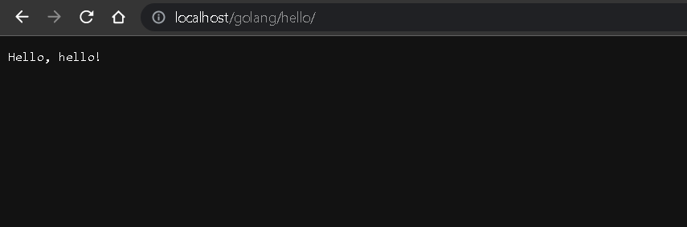
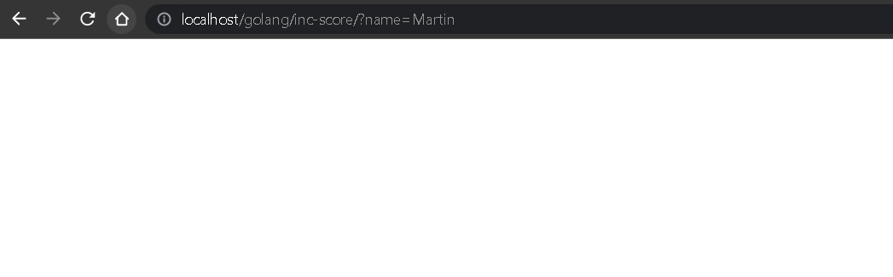
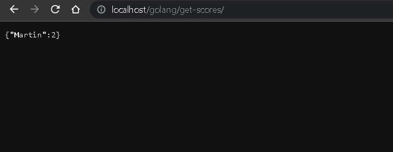
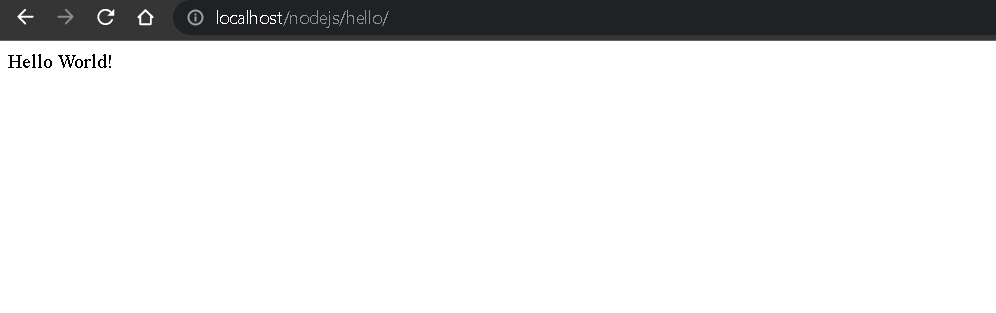
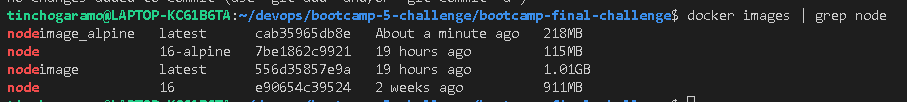

# Final Challenge - Bootcamp DevOps

### Testing solution.sh - Docker build/run

```
tinchogaramo@LAPTOP-KC61B6TA:~/devops/bootcamp-5-challenge/bootcamp-final-challenge$ ./solution.sh 
Sending build context to Docker daemon  4.608kB
Step 1/8 : FROM golang:1.19
 ---> 4f7c78c9b46f
Step 2/8 : WORKDIR /usr/src/app
 ---> Using cache
 ---> f387141b655d
Step 3/8 : COPY go.mod ./
 ---> Using cache
 ---> 5b59952b8184
Step 4/8 : RUN go mod download && go mod verify
 ---> Using cache
 ---> f091b6f6e86f
Step 5/8 : COPY *.go  ./
 ---> 3a6d448a2850
Step 6/8 : RUN go build -v -o /usr/local/bin/app ./...
 ---> Running in cc4f80241088
example/hello-world-golang
Removing intermediate container cc4f80241088
 ---> 1153dec711cb
Step 7/8 : EXPOSE 3002
 ---> Running in 00721a8d46ee
Removing intermediate container 00721a8d46ee
 ---> 8e72d7f59750
Step 8/8 : CMD ["app"]
 ---> Running in 95c583a25ab1
Removing intermediate container 95c583a25ab1
 ---> 435157eaaef6
Successfully built 435157eaaef6
Successfully tagged goimage:latest

Use 'docker scan' to run Snyk tests against images to find vulnerabilities and learn how to fix them
Sending build context to Docker daemon  69.12kB
Step 1/7 : FROM node:16-alpine
 ---> 7be1862c9921
Step 2/7 : WORKDIR /app
 ---> Running in 0ef66ac9f10b
Removing intermediate container 0ef66ac9f10b
 ---> a07e8655f3c8
Step 3/7 : COPY . .
 ---> 5bbb99bced38
Step 4/7 : RUN npm install express
 ---> Running in 6fdd7d6792a7

added 85 packages, and audited 86 packages in 3s

7 packages are looking for funding
  run `npm fund` for details

found 0 vulnerabilities
npm notice
npm notice New minor version of npm available! 8.15.0 -> 8.19.2
npm notice Changelog: <https://github.com/npm/cli/releases/tag/v8.19.2>
npm notice Run `npm install -g npm@8.19.2` to update!
npm notice
Removing intermediate container 6fdd7d6792a7
 ---> 9723790fda2c
Step 5/7 : RUN npm install -g npm@8.19.2
 ---> Running in 9c701d09da69

changed 54 packages, and audited 212 packages in 13s

11 packages are looking for funding
  run `npm fund` for details

found 0 vulnerabilities
Removing intermediate container 9c701d09da69
 ---> 34d3f1df7956
Step 6/7 : EXPOSE 3000
 ---> Running in e6857bf43f56
Removing intermediate container e6857bf43f56
 ---> 1aba66fab8ff
Step 7/7 : CMD [ "node", "server.js" ]
 ---> Running in b23250e91708
Removing intermediate container b23250e91708
 ---> cab35965db8e
Successfully built cab35965db8e
Successfully tagged nodeimage_alpine:latest

Use 'docker scan' to run Snyk tests against images to find vulnerabilities and learn how to fix them
Sending build context to Docker daemon   5.12kB
Step 1/4 : FROM nginx:alpine
 ---> 804f9cebfdc5
Step 2/4 : RUN apk add --no-cache jq curl
 ---> Running in 63639ce90f32
fetch https://dl-cdn.alpinelinux.org/alpine/v3.16/main/x86_64/APKINDEX.tar.gz
fetch https://dl-cdn.alpinelinux.org/alpine/v3.16/community/x86_64/APKINDEX.tar.gz
(1/2) Installing oniguruma (6.9.8-r0)
(2/2) Installing jq (1.6-r1)
Executing busybox-1.35.0-r17.trigger
OK: 27 MiB in 44 packages
Removing intermediate container 63639ce90f32
 ---> ea09e328ee68
Step 3/4 : EXPOSE 18181
 ---> Running in bbcd6d578ae0
Removing intermediate container bbcd6d578ae0
 ---> abc6b9f3a9d4
Step 4/4 : COPY docker-deps/default.conf /etc/nginx/conf.d/default.conf
 ---> 1e1e60d61711
Successfully built 1e1e60d61711
Successfully tagged nginximage:latest

Use 'docker scan' to run Snyk tests against images to find vulnerabilities and learn how to fix them
48cd3aeb1f8bf5df8fdb45d321c70694210a92e8aa0fd960f1f54b51f7bbffa7
4896575a32ed20c21925da9b1212f4ff7ef275bb54a8f9d324a60d306cf37781
e8b43dfcb77ac0757bb0a2a8055f1e2216a769977d1fe6aa690514eafb164ce7

tinchogaramo@LAPTOP-KC61B6TA:~/devops/bootcamp-5-challenge/bootcamp-final-challenge$ docker ps
CONTAINER ID   IMAGE              COMMAND                  CREATED          STATUS          PORTS                                             NAMES
e8b43dfcb77a   nginximage         "/docker-entrypoint.…"   20 seconds ago   Up 19 seconds   80/tcp, 0.0.0.0:80->18181/tcp, :::80->18181/tcp   nginxapp
4896575a32ed   nodeimage_alpine   "docker-entrypoint.s…"   21 seconds ago   Up 20 seconds   0.0.0.0:3000->3000/tcp, :::3000->3000/tcp         nodeapp
48cd3aeb1f8b   goimage            "app"                    22 seconds ago   Up 21 seconds   0.0.0.0:3002->3002/tcp, :::3002->3002/tcp         goapp
```

### Testing Endpoints
http://localhost/golang/hello/


http://localhost/golang/inc-score?name=Martin


http://localhost/golang/get-scores


http://localhost/nodejs/hello/


### Size difference between original and new Node Docker Image
